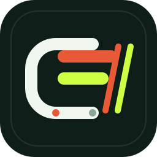

<div align="center">



# CAMIS

**Corporate Action Margin Impact Simulator**

A Bitget rToken margin workbench for seeing how corporate actions affect collateral, leverage, margin ratio, and liquidation distance before settlement.

[Live app](https://c-a-m-i-s.vercel.app) · [Repository](https://github.com/Valorian0108/C.A.M.I.S) · [Launch post](https://x.com/IfeTeddy0108/status/2101985506267373577?s=20)


</div>

---

## The Short Version

CAMIS is built around one question:

> If I keep this rToken as collateral through a corporate action, what happens to my margin position?

Bitget rTokens can adjust when the underlying stock has an event such as a split, dividend, or other corporate action. That may feel seamless for someone simply holding the token. For a trader using the rToken as collateral, the same event can change collateral value, adjusted equity, leverage, margin ratio, and liquidation distance.

CAMIS makes that change visible before the event settles.

It connects live Bitget market data, Bitget account context, collateral discount data, corporate-action checks, deterministic margin simulation, and AI explanation into one research screen.

## Demo Task

The demo walkthrough answers one research question:

> Does this upcoming or modeled rToken corporate action make my collateral position riskier?

The user selects an rToken event, checks live data sources, compares the before and after account state, reads the AI explanation, and compares three possible responses: hold, add collateral, or reduce exposure.

This is not a price prediction tool. CAMIS is a pre-event margin impact tool.

## Why This Matters

Most traders can already see an asset price. They can also see their current account balance. The missing part is the consequence path.

If an rToken is about to go through a corporate-action adjustment, a margin trader needs to know what the event could do to the account early enough to respond. The useful window is before the position becomes unsafe, not after the liquidation buffer has already changed.

CAMIS focuses on that moment.

## What CAMIS Does

CAMIS lets a trader inspect an rToken event and see how it may affect a leveraged account.

It shows:

- the selected rToken and its live Bitget spot price;
- whether live data sources are connected;
- account assets from the connected Bitget account;
- corporate-action lookup status;
- Bitget market prices for tracked rToken pairs;
- collateral discount-rate checks from Bitget public data;
- before and after values for collateral, equity, leverage, margin ratio, and liquidation distance;
- a comparison of three trader responses: hold, add collateral, or reduce exposure;
- a plain-language AI explanation of what changed and why it matters.

The core value is simple: CAMIS turns event risk into a readable margin decision before settlement.

## How It Works

CAMIS works in four layers.

### 1. Live Market Layer

The app pulls live Bitget spot data for rToken pairs such as `RNVDAUSDT`, `RTSLAUSDT`, and `RQQQUSDT`. It also supports searching Bitget spot pairs, so the workbench is not locked to only the default scenarios.

### 2. Account Layer

The backend reads the connected Bitget account through server-side API credentials. If the selected rToken exists in the account, CAMIS can use the live account asset balance in the consequence table. If the selected asset is not present, the app clearly labels that it is using scenario sizing.

### 3. Simulation Layer

The margin table calculates the before and after path from account inputs, live price, collateral assumptions, and the selected event case. This is deterministic math. The AI does not invent the numbers.

### 4. Explanation Layer

The AI receives the calculated before and after state, then turns it into a short trader-readable explanation. It explains what changed, whether the buffer improved or worsened, and what the selected action means.

## What The AI Does

AI in CAMIS is used as an explanation layer, not as the source of truth.

The AI does:

- explain the margin impact in plain language;
- summarize the difference between the before and after account state;
- describe whether risk improved or worsened;
- help the user understand the selected action path.

The AI does not:

- execute trades;
- make private account changes;
- replace Bitget account data;
- decide the margin numbers on its own.

CAMIS calculates first, then the AI explains.

## Current Build

The current build includes:

- live Bitget rToken spot prices;
- searchable Bitget spot pairs;
- live Bitget account asset checks;
- live collateral ratio checks from Bitget public data;
- corporate-action lookup through Alpaca where available;
- AI analysis using Qwen when configured;
- visible live, fallback, and unavailable states;
- scenario controls for hold, add collateral, and reduce exposure;
- a judge demo path that shows whether the main live pieces are ready.

Some event cases are still modeled because corporate-action timing and exact rToken treatment need reliable event-specific inputs. CAMIS labels those parts honestly instead of pretending that every event field is live.

## Data Sources

- **Bitget market ticker endpoint** for live rToken spot prices.
- **Bitget UTA account assets endpoint** for account asset checks.
- **Bitget public discount-rate endpoint** for collateral ratio context.
- **Alpaca corporate actions API** for external corporate-action lookup where matching records exist.
- **Qwen** for concise AI explanation of the calculated margin impact.

## Tools Used

- **Bitget API and Bitget Agent Hub references** for rToken market data, account context, and collateral-related checks.
- **Qwen** for the AI explanation layer.
- **Alpaca corporate actions API** for corporate-action lookup.
- **React and Vite** for the frontend.
- **Express and Node.js** for the backend API.
- **TypeScript** for shared types and safer implementation.
- **Vercel** for deployment.
- **Codex** for implementation support, debugging, and iteration.

## Running Locally

Install dependencies:

```bash
pnpm install
```

Start the API server:

```bash
pnpm --filter @workspace/api-server run dev
```

Start the frontend:

```bash
pnpm --filter @workspace/mockup-sandbox run dev
```

The frontend runs on:

```text
http://localhost:5173/
```

The API runs on:

```text
http://localhost:5000/api
```

## Environment Variables

The backend expects live API keys to be configured in the hosting environment:

```text
BITGET_API_KEY
BITGET_API_SECRET
BITGET_PASSPHRASE
BITGET_BASE_URL
BITGET_QWEN_API_KEY
BITGET_QWEN_BASE_URL
BITGET_QWEN_MODEL
ALPACA_API_KEY
ALPACA_API_SECRET
```

Secrets should stay server-side. They should not be placed in frontend code.

## Vercel Deployment

This repository is configured for Vercel.

The frontend builds to:

```text
artifacts/mockup-sandbox/dist
```

The backend is exposed through a Vercel serverless catch-all under:

```text
/api/*
```

That means frontend requests such as `/api/market-data`, `/api/account-snapshot`, and `/api/margin-explanation` can work on the same deployed domain when environment variables are configured.

## Limitations

CAMIS does not execute trades. It does not automatically rebalance the account. It also does not claim that every corporate-action field is live when the exact event treatment still needs event-specific mapping.

The product is designed as a research and decision-support desk. The trader remains in control.

## Project Direction

CAMIS is not trying to be another trading dashboard. It is focused on one risk that is easy to miss: what a corporate action does to a leveraged rToken account before the event is applied.

Next steps:

- add more event templates;
- improve event-specific corporate-action mapping;
- expand the searchable rToken workflow;
- refine account-specific scenario sizing;
- add clearer evidence trails for each live data source.

The core idea stays the same: show the margin consequence early, explain it clearly, and help the trader decide before the account is under pressure.
